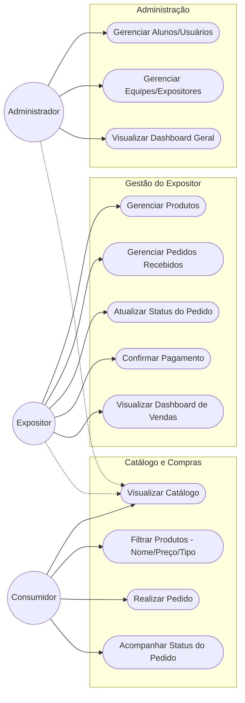

# Diagrama de Casos de Uso - IFS Hackathon App

Este documento apresenta os atores e suas interações com o sistema desenvolvido.

## Descrição dos Atores

1.  **Consumidor**: Usuário final que navega pela feira, visualiza produtos e realiza compras.
2.  **Expositor**: Aluno ou equipe responsável por um estande. Gerencia seus produtos, atende pedidos e acompanha suas vendas.
3.  **Administrador**: Responsável pela organização do evento. Cadastra alunos, forma equipes e monitora o desempenho geral da feira.
