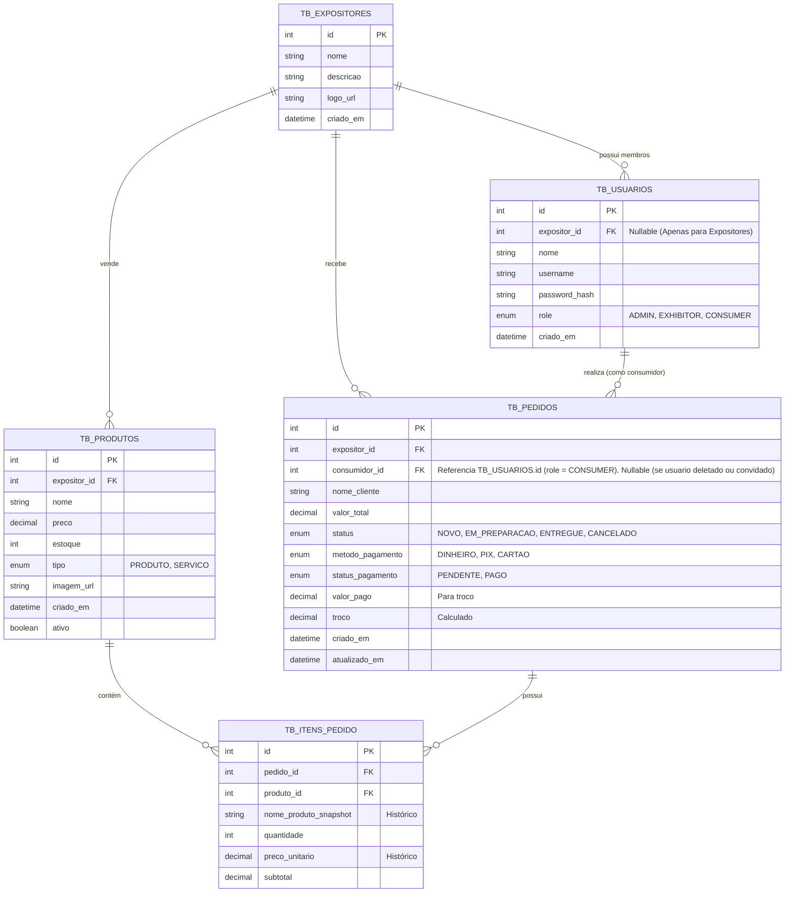

# Modelo de Banco de Dados Relacional - IFS Hackathon App

Este documento descreve o modelo de dados relacional projetado a partir da aplicação desenvolvida (`store.js`). O modelo visa normalizar os dados e garantir a integridade referencial.

## Diagrama Entidade-Relacionamento (DER)

> Nota: `consumidor_id` e uma FK para `TB_USUARIOS.id`, usada apenas quando o usuario tem `role = 'CONSUMER'`. Para pedidos de convidado ou quando o usuario foi removido, este campo permanece nulo.

## Dicionário de Dados

### 1. TB_EXPOSITORES (Teams)
Armazena as equipes ou turmas que estão expondo na feira.
*   **id**: Chave primária.
*   **nome**: Nome da equipe (ex: "Turma 3A - Doces").
*   **descricao**: Descrição breve do estande.

### 2. TB_USUARIOS (Users)
Armazena todos os usuários do sistema (Administradores, Expositores e Consumidores).
*   **id**: Chave primária.
*   **expositor_id**: Chave Estrangeira para `TB_EXPOSITORES`. Nulo para Admins e Consumidores.
*   **role**: Define o nível de acesso ('ADMIN', 'EXHIBITOR', 'CONSUMER').

### 3. TB_PRODUTOS (Products)
Itens (bens ou serviços) oferecidos pelos expositores.
*   **id**: Chave primária.
*   **expositor_id**: Vincula o produto ao expositor dono.
*   **tipo**: Distingue entre 'Produto' físico (estoque relavante) e 'Serviço'.
*   **ativo**: Flag para exclusão lógica (soft delete).

### 4. TB_PEDIDOS (Orders)
Transações de compra realizadas.
*   **id**: Chave primária.
*   **consumidor_id**: FK para `TB_USUARIOS.id` filtrando `role = 'CONSUMER'`. Nulo para convidado ou usuario removido.
*   **nome_cliente**: Nome de exibição do cliente.
*   **expositor_id**: Expositor que recebeu o pedido.
*   **status**: Estado atual do fluxo ('Novo' -> 'Em Preparação' -> 'Entregue').
*   **pagamento_***: Campos para controle financeiro e troco.

### 5. TB_ITENS_PEDIDO (Order Items)
Detalhes dos produtos em cada pedido (tabela pivô).
*   **nome_produto_snapshot**: Cópia do nome do produto no momento da compra (importante se o produto mudar de nome depois).
*   **preco_unitario**: Preço no momento da compra (evita alterações históricas se o preço do produto mudar).

## Notas de Implementação
*   **Passwords**: No protótipo atual estão em texto plano, mas no banco real devem ser hashes (ex: bcrypt).
*   **Imagens**: Podem ser armazenadas como URLs (CDN/S3) ou Base64 (menos recomendado para produção, mas usado no protótipo).
*   **Troco**: A lógica de troco é calculada no front, mas os valores `valor_pago` e `troco` são persistidos para conferência do expositor.

